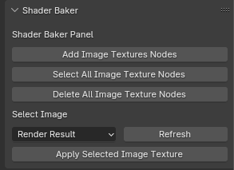

# ShaderBaker
 A Blender3D tool that automates the baking process. Helps with objects with multiple shaders that need to be baked onto an image.

This tool is still currently in production.

# Description
This tool is built to automate the baking process for objects with multiple materials. With a click of a button, users can add image texture nodes to all materials of a selected object, then apply a UV map of their choice, and bake it into the settings.

# Install

# How to Use

## Image Texture Node Settings
### Add Image Texture Nodes
* Adds image texture nodes to all materials of the selected object.

### Select All Image Texture Nodes
* Deselects all nodes and only selects the image texture node holding the UV map for baking.

### Delete all Image Texture Nodes
* Deletes all image texture nodes generated by this tool.

## UV Map Settings
### Selecting a texture
1. Select the UV map or image texture from the drop down menu.
2. Click Apply selected image texture.
3. Applies image texture to all image texture nodes generated by the tool.

### Refresh button
* Currently not functional
* If new image/UV map was made, then click refresh to find the new image.